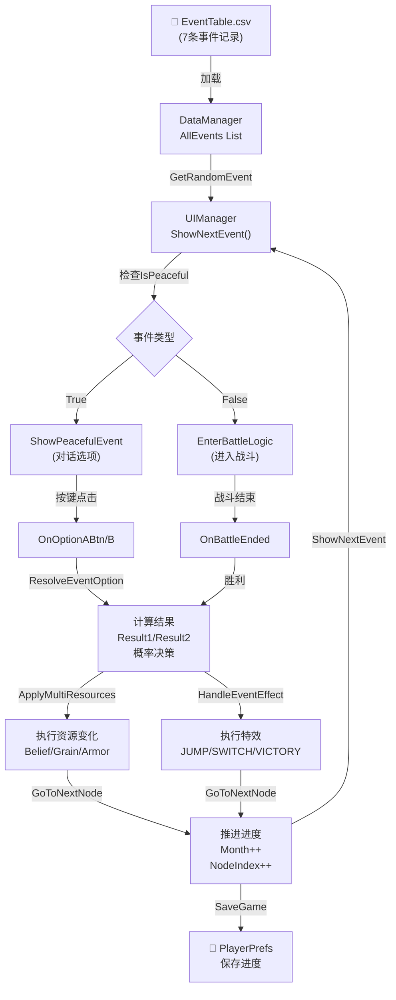
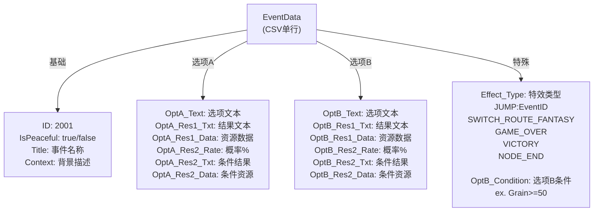
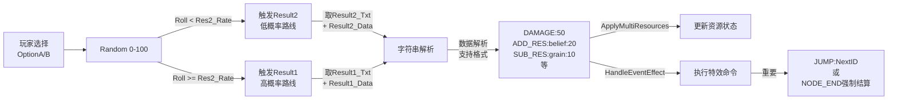
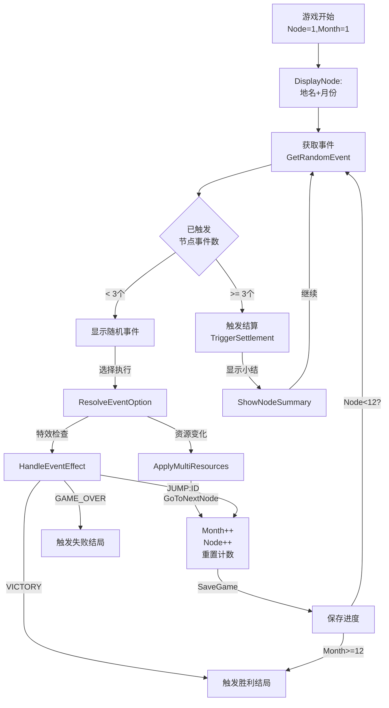
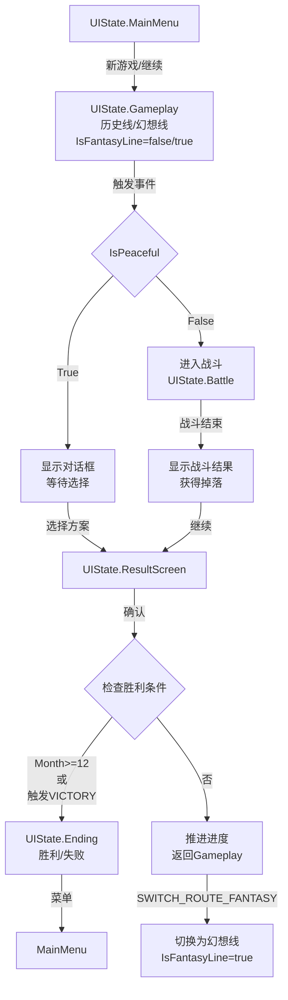
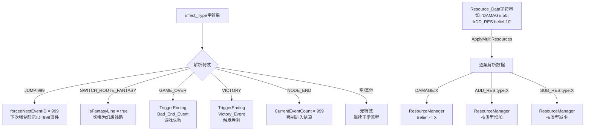
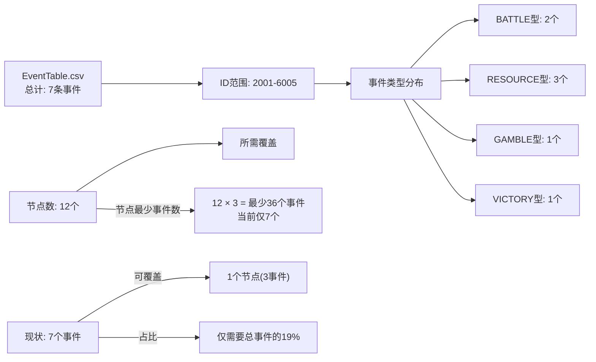
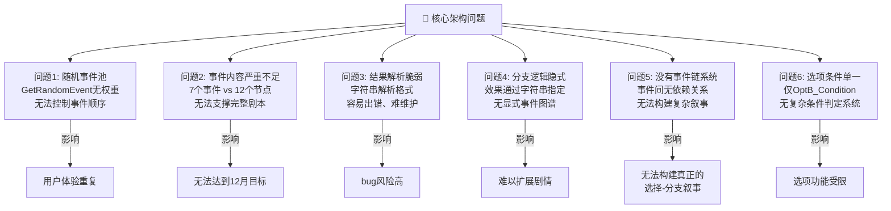
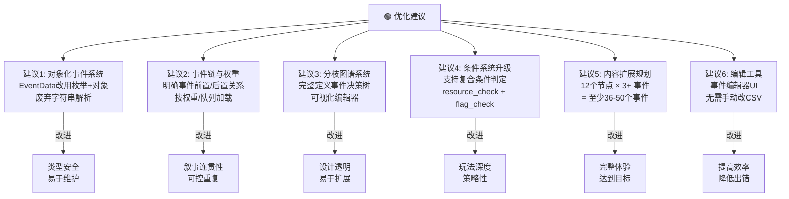

# 事件系统架构 - Mermaid 图表

## 1. 完整数据流转流程



---

## 2. EventData 结构详解



---

## 3. 事件决议流程（重要！）



---

## 4. 节点循环流程



---

## 5. 状态机与分支路线



---

## 6. 资源变化与特效系统



---

## 7. 当前数据量统计



---

## 8. 当前系统的关键问题



---

## 9. 推荐优化方向



---

## 10. CSV数据行为示例

### 当前格式（已精简）
```
ID,IsPeaceful,Title,Context,OptA_Text,OptA_Res1_Txt,OptA_Res1_Data,OptA_Res2_Rate,OptA_Res2_Txt,OptA_Res2_Data,...
2001,1,农民起义,民众遭压迫,安抚民众,获得支持,ADD_RES:belief:20,20,激怒民众,SUB_RES:belief:50,...
```

### 优化后建议
```
EventID | EventName    | Type    | ChainID | Prerequisites | OptA.Result | OptB.Result | Effect
--------|--------------|---------|---------|---------------|-------------|-------------|--------
2001    | 农民起义      | CHOICE  | 2002    | Month<3       | Belief+20   | Belief-50   | -
2002    | 民心叛乱      | BATTLE  | 2003    | Event:2001.A  | Battle:101  | -           | -
...
```

---

## 总结

| 维度 | 当前状态 | 评价 | 优先级 |
|------|---------|------|--------|
| **数据量** | 7个事件 | ⚠️ 严重不足 | 🔴 优先 |
| **架构** | 字符串解析 | ⚠️ 脆弱易错 | 🔴 优先 |
| **分支系统** | 隐式JUMP | ⚠️ 无法管理 | 🟠 次优 |
| **条件系统** | 仅OptB_Condition | ⚠️ 功能有限 | 🟠 次优 |
| **扩展性** | 低效率 | ⚠️ 难维护 | 🟡 可后续 |
| **运行稳定性** | 正常 | ✅ 无bug | 🟢 已达成 |

**核心建议**: 在添加36-50个新事件前，应该先重构事件系统的数据模型和解析逻辑。
